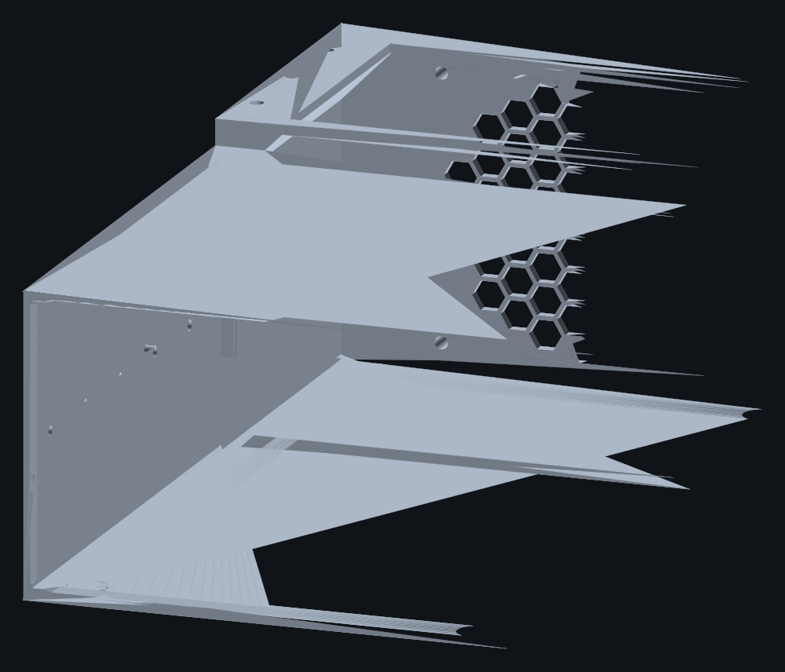
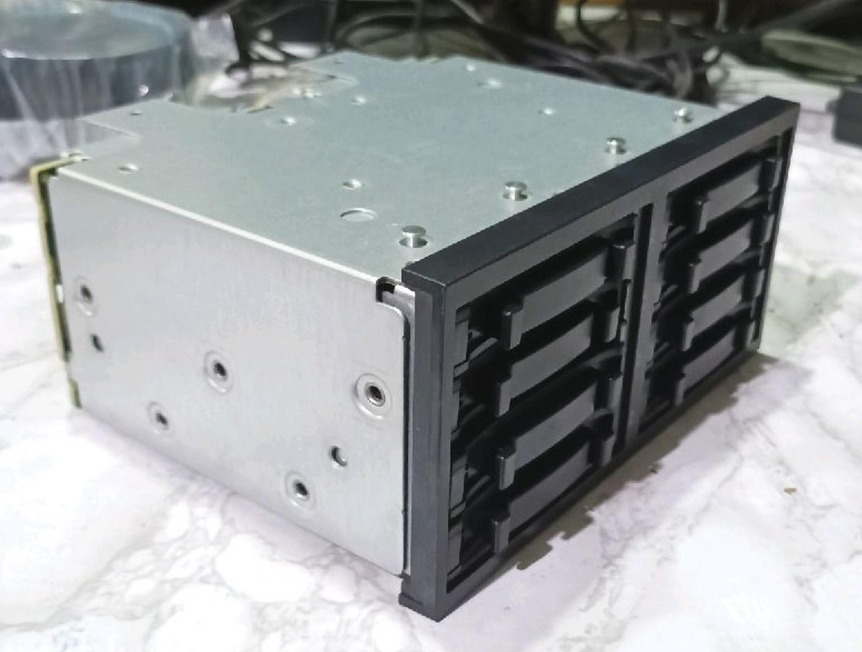

# Installation guide

How to assemble the DL380 case. Read the **Order of work** section first — several
steps are only possible in one sequence.

Run `freecadcmd dl380_cage_case.py` first if `out/` is empty; the numbers below come
from [`out/dl380_cage_case_report.txt`](out/dl380_cage_case_report.txt).

---

## Conventions

The model uses these axes, and this guide uses them throughout:

| Direction | Meaning |
|---|---|
| **front** | the big open rectangular mouth — where caddies are inserted |
| **back / rear** | the face with the honeycomb grille, cable slots and DC jack |
| **top** | the face with the long service opening and the screwed-on lid |
| **inside** | the plenum behind the backplane — reached through the top opening |

There is **no way in from the back**. Everything except the cage goes in through the
top service opening or the front mouth.

---

## What you need

**Printed**

| Part | File | Notes |
|---|---|---|
| Body | `out/dl380_cage_case_body.stl` | the big one; prints flat on its base, front opening up, **no supports** |
| Service lid | `out/dl380_cage_case_lid.stl` | prints flat |
| PSU strap | `out/dl380_cage_case_strap.stl` | prints flat |

**Hardware**

| Item | Qty | Where |
|---|---|---|
| **Mandatory screws / inserts** | **0** | **100% toolless assembly** |
| ARCTIC P9 PWM PST 92 mm | 1 | rear fan housing |
| PicoPSU-120 (31 × 44 × 21 mm) | 1 | cradle with snap-fit strap |
| Panel-mount 5.5 × 2.5 mm DC jack | 1 | rear wall counterbore |
| Rubber feet Ø12 × 2 mm | 4 | base |
| SFF-8087 → SFF-8088 cables | 2 | rear slots |
| Wago 221 lever terminals | 3 | plenum |
| *Optional: M3 heat-set inserts* | *4* | *fan mounting (only if bolting for transport)* |
| *Optional: M3 × 30 screws* | *4* | *fan mounting (only if bolting for transport)* |

**Tools**: Flush cutters and a small scraper or deburring tool. (No soldering iron or hex drivers needed for mandatory assembly!).



---

## Order of work

```
 1  print + clean up
 2  dry-fit the cage                 (checks the slide between rails before wiring)
 3  fan                              <- slides straight down into rear housing slot
 4  cage, in from the FRONT          <- slides along internal bottom rails and top ribs
 5  DC jack in the rear wall
 6  SFF-8087 cables in from the back, onto the backplane
 7  wiring: PicoPSU -> Wagos -> backplane, ground PS_ON#
 8  PicoPSU into the cradle + snap-fit strap
 9  slide-and-click service lid      <- slides +Z and clicks shut
10  rubber feet
11  first power-up
```

Steps 3 and 4 can be swapped. Everything else has to be in this order: the cables
want the cradle empty, the PSU wants the cables already routed, and the lid closes
the only way in.

---

## Step 1 — print and clean up

Print the body flat on its base with the front opening pointing up. **No supports
are needed and none should be used** — the internal 45° roof gussets, 45° slide rails,
and the 3 mm grille membrane are designed to print unsupported.

The lid prints top-plate face down on the bed with skirts pointing up (45° runner grooves
are self-supporting). The strap prints flat on the bed.

Check these before you go further:

- **every outer edge is rounded** — R1.4 on the body, R1.0 on the lid, R1.4 on the
  strap.
- the 45° slide rails on the body's outer plenum walls are clean and free of z-blobs.
- the recessed catch pocket on the front vertical step ($Z = 165\text{ mm}$) is clear.
- the lid's runner grooves and cantilever latch tooth are cleanly resolved.
- the honeycomb grille is open. The webs are 1.2 mm — **three 0.4 mm lines** — so
  don't use a nozzle bigger than 0.4 mm, and don't jab them with a scraper.
- the two rear cable slots and the Ø8 DC jack hole are clear.

---

## Step 2 — dry-fit the cage

Do this now, while the box is completely empty and you can still see what you're
doing.

**The cage slides in from the front between internal guide rails — straight, not tilted, no screws.**
It enters through the 145.8 × 87.8 mm front aperture, engages the bottom slider rails and ceiling ribs, and travels 162 mm until it seats firmly against the rear stop frame.



| | |
|---|---|
| Cage | 145.0 × 87.0 × 165.0 mm |
| Front aperture | 145.8 × 87.8 mm (framed by 29.9 mm front cheeks) |
| Internal guide rails | Bottom rails (14 mm tall) and ceiling ribs (5 mm tall) with 1.5 mm lead-in chamfers |
| Clearance | **0.4 mm per side** — a smooth slide fit |
| Lateral wiring space | **27.1 mm clear chamber** on the left for the 10-pin power socket and cable |

0.4 mm per side is a proper slide fit but it is not loose. It will jam if you
corkscrew it, so:

1. Set the case on its base on the bench.
2. Pick the cage up by both sides, backplane away from you.
3. Line the cage up square in the front mouth. The internal rails have 1.5 mm 45° chamfers to catch the cage edges.
4. Push it in **straight** — both hands, equal pressure, no rocking.
5. It should slide smoothly between the floor rails and ceiling ribs, stopping with a firm, definite feel when it meets the internal stop frame at Z = 162 mm.
6. When seated, the cage's front bezel rests flush against the front face, completely sealing the front of the enclosure.

That stop frame is a 4 mm-wide ledge with a 137.8 × 79.8 mm aperture in it. The
cage's rear butts against it and that sets the depth. The relief notch on the left
rib gives unobstructed clearance for the 10-pin backplane power header.

**If it fights you**: don't force it. Find the tight corner, lift it out, look for
print elephant-footing or blobs on the inside of the sleeve or guide rails, scrape them off, and
try again.

Pull it back out for now — you want the box empty for the fan.

---

## Step 3 — the fan (do this before the cage)

The fan is the deepest thing in the case. It has a **full-height U-channel housing with front retaining rails**:
it slides straight down into a captive vertical track and seats on the plenum floor, giving a **firm press-fit feel with zero screws**.

**Where it lands**

| | |
|---|---|
| Track | Z 219.90 → 245.00, providing an exact **25.10 mm track depth** for the 25.0 mm fan frame |
| Seat | the plenum floor — the frame's bottom edge rests on it |
| Sides (X) | two tall guide rails extending up to Y = 90.0 mm (86 mm tall) with 0.15 mm clearance per side and 2.5 mm lead-in chamfers |
| Front lips (Z-) | **front retaining rails** overlap the frame by 2.5 mm per side with top entry chamfers; clears the Ø86 mm blade opening |
| Up (Y+) | two fins on the lid later come down to 1 mm above its top edge |

**How to get it in.** The service opening in the top runs Z 165 → 245. Lower the
frame flat (hub up) into the **rear end** of that opening, over Z 220–245, and slide it down.

1. Line the frame up over the **rear end** of the opening. The guide rails and front retaining lips have generous 2.5 mm lead-in chamfers to guide the corners in smoothly.
2. Push it straight down. The fan slides snugly into the U-channel track and lands on the plenum floor.
3. It is seated when the frame's bottom edge is flat on the floor and its rear face is flush against the inside of the rear wall. The 25.10 mm track depth gives a snug press-fit feel: rock-solid with zero rattle or wobble.
4. Check the airflow arrow points **out of the back** — this fan exhausts. Also check its lead trails out of the front of the frame, not trapped behind it.
5. **Route the lead now, while there is room.** Run it forward along one side of the plenum, tucked down low against the floor, and leave it long enough to reach the Wagos.
6. That is it — no screws. When the lid is installed at step 9, its underside fins hold the top of the frame, capturing the fan in all directions.

*(Optional: If you plan on tossing the case into a backpack and want the fan permanently bolted, you can press 4× M3 inserts into the rear face from the outside and run 4× M3 × 30 screws from inside).*

---

## Step 4 — the cage, in from the front

Same slide as step 2, but now you know it fits. Push it in square and straight until
it stops on the rear frame at Z = 162 mm. The cage is captured securely between the
bottom rails and top ribs with zero screws needed.

---

## Step 5 — the DC jack

The rear wall takes a panel-mount 5.5 × 2.5 mm barrel jack at **(+70, 52)**:

| | |
|---|---|
| Jack body hole | Ø8.0 through |
| Counterbore | Ø16.0 × 5 mm deep, in the **outside** face |
| Panel the jack sees | **3.4 mm** |

The counterbore is there on purpose: the wall is 8.4 mm thick and most panel-mount
jacks won't clamp a panel that thick. Feed the jack through from **outside**, body
first, and the nut lands on the 3.4 mm floor of the counterbore. Solder your leads
to the tags on the inside before you tighten it down.

---

## Step 6 — the SFF-8087 cables

There are two slots in the rear wall, both at **X = −70**, at **Y = 33** and
**Y = 50**, each 17 × 12 mm with rounded corners. Do these before the PicoPSU goes
in — you need the cradle empty to get your hand in.

1. From **outside**, feed each SFF-8088 overmould through its own slot, in to the
   plenum. One cable per slot.
2. Reach in through the top opening and pull the tail forward to the backplane.
3. Plug both SFF-8087 ends into the backplane, reaching forward past the front edge
   of the opening to Z 165.
4. Pull the slack back so the cables lie along the **left-hand side** of the plenum
   and leave the middle clear for the PSU.

---

## Step 7 — wiring & Wago layout

The HP DL380 G6/G7 backplane features a 10-pin power socket that faces directly to
the **left (-X)**.

**Plenum clearance**:
- The plenum and bay are **200 mm wide internally (205.6 mm outside)**, providing **27.1 mm of
  clearance** to the left of the cage and backplane PCB ($X = -72.9\text{ mm}$ to $-100.0\text{ mm}$).
- An internal stop rib notch at $X = -72.9 \to -68.9\text{ mm}$ ($Y = 35 \to 85\text{ mm}$)
  ensures the connector housing seats cleanly without obstruction.
- The 10-pin cable plugs in from the left and bends backward into the plenum.

**Wago lever block placement**:
- The transverse PicoPSU cradle is shifted to the right ($X = +40.0\text{ mm}$),
  leaving **117.2 mm of wide, open floor on the left (X = -100.0 to +17.2 mm)**.
- Place three Wago 221 lever connectors (12 V, 5 V, Ground) on the open floor on the
  left side.
- Connect the 10-pin backplane power leads and PicoPSU outputs into the Wago blocks:
  - Yellow: 12 V (from PicoPSU 12 V rail & external DC input)
  - Red: 5 V (from PicoPSU 5 V rail)
  - Black: Ground (common ground for backplane, PicoPSU, and DC jack)

**Crucial PicoPSU configuration**:
- **There is no motherboard in this box**, so a PicoPSU will not start on its own.
  Its **PS_ON# pin (green wire on 24-pin ATX) must be tied to ground** (black wire)
  for it to turn on as a standalone power supply.
- Connect the ARCTIC P9 fan (12 V and Ground) to the corresponding Wago blocks.

---

## Step 8 — the PicoPSU into the cradle + snap-fit strap

The cradle is sized for the **bare picoPSU-120 board, 31 × 44 × 21 mm**, oriented
**transversely (44 mm across X, 31 mm along Z)** at $X = +40.0\text{ mm}$.

| | |
|---|---|
| Cradle bore | 45.6 (across X) × 32.6 (along Z) mm (0.8 mm clearance per side) |
| Cradle Z | 177.0 → 209.6 mm |
| Board sits on | a 3 mm plinth, so the solder side never touches the floor |
| Front lip | 6 mm tall — 3 mm above the plinth |
| Backplane gap | the mouth is 12 mm behind the backplane; the board stops 13.6 mm short of it |
| Snap strap | 67.2 × 4 × 14 mm snap-fit clip with 0.8 mm undercut catch teeth |

1. Route the output harness and the DC input leads out of the cradle toward the
   left/front before dropping the board in.
2. Lower the board into the cradle at $X = +40.0\text{ mm}$.
3. The 6 mm front lip prevents the board from sliding forward.
4. Take the **snap-fit strap** and press it down over the cradle corner bosses.
   The compliant legs flex outward over the retention ledges and click
   firmly into place. **No screws, no tools.**

---

## Step 9 — the slide-and-click lid

The service lid uses a **slide-and-click mechanism**: it slides forward horizontally
into 45° beveled rails on the outer plenum walls and clicks shut with an integrated
cantilever latch. **100% screwless.**

1. Check nothing is proud of the top: no cable or Wago sticking up into the opening.
2. Position the lid over the rear of the plenum, aligning the skirt runner grooves
   with the 45° slide rails on the case's outer walls.
3. Push the lid **forward (+Z)** along the rails. It slides smoothly toward the front.
4. As it reaches the front step ($Z = 165\text{ mm}$), the cantilever snap latch
   tooth will ride up over the step bevel and **click audibly** into the recessed
   catch pocket.
5. The lid is now locked in all 6 degrees of freedom:
   - X and Y restrained by the 45° interlocking rails.
   - -Z restrained by the front vertical step.
   - +Z restrained by the snap latch tooth.

**To remove the lid:** Hook your index finger into the **front pull ring** (Ø14 mm hole at front center) and pull backward. The snap latch disengages and the lid glides open smoothly along the slide rails.

**Fan retention:** The fan is captured firmly on all four vertical corners by the body's full-height press-fit U-channel track and front retaining rails. The lid underside is flush, providing a smooth, clean ceiling over the plenum without internal fins.

---

## Step 10 — rubber feet

Four Ø12 × 2 mm recesses in the base at (±61, Z 14) and (±61, Z 239.4). Push-fit; a
dab of cyanoacrylate if they're loose.

---

## Step 11 — first power-up

1. Before applying power: **no loose wires trapped between lid and body**, no bare
   conductor touching the backplane or sheet metal cage.
2. Power up and confirm the fan spins and pushes air **out of the back**. Hold a
   tissue near the grille — it should be pushed away, not sucked in.
3. If the fan doesn't run, check the PS_ON# jumper first (step 7).
4. Run it for ten minutes and feel the rear wall and the grille. If the plenum is
   uncomfortably hot, the fan is restricted or running too slow — the P9 is PWM and
   idles quietly, so give it some duty cycle.

---

## Troubleshooting

| Symptom | Cause |
|---|---|
| Cage won't start into the mouth | the lead-in is only 0.8 mm and printing blobs or elephant-footing make it worse; scrape the sleeve and start it squarer. Don't force it — 0.4 mm/side is not a clearance you can bully |
| Something on the outside feels sharp | a print defect, not the design — every outer edge is R1.4 / R1.0. Deburr it |
| Cage stops short of the front face | something in the bay behind it, or it's wedged; lift out and look |
| Fan won't drop into the plenum | you're forward of the housing — lower it directly over Z 220–245 |
| Fan fits but rattles | the housing fit is 0.2 mm per side; lower `FAN_GUIDE_CLEAR` and rebuild |
| Fan won't go into the housing | raise `FAN_GUIDE_CLEAR`, or scrape the two rails |
| Fan lifts when I turn the case over | the lid is what holds it down — its two fins sit 1 mm above the frame. With the lid off, the fan is only held by gravity. Reduce `FAN_LID_GAP` if you want it clamped tighter |
| PicoPSU won't start | PS_ON# isn't grounded (step 7) |
| Strap won't sit down | the 24-pin ATX connector is standing up under it — move the strap along the cradle |
| DC jack won't clamp | your jack's neck is shorter than 3.4 mm; reduce `DC_JACK_DEPTH` and rebuild |
| Lid won't slide smoothly | rail tolerance or print artifacts; gently deburr the 45° runner grooves or rails |
| Lid won't click shut | check that the catch pocket at Z=165 is clear of debris or wires |

---

## If you change anything, re-check these

Two numbers in this guide are *derived* and both are printed in the build report, so
you don't have to work them out again:

- **`fan drop-in window : Z …`** — the band the fan must be lowered into. If
  `PLENUM_D`, `PSU_*` or `FAN_INSET` change and this band goes empty, the report
  prints `*** FAN CANNOT BE FITTED ***` instead of a number.
- **`opening size`** and the roof margins — the lid needs the side strips, the front
  band and the rear wall top to sit on.

Run `freecadcmd verify_step.py` after any rebuild; it probes the exported STEP and
exits non-zero if any opening is blocked or any wall is missing.
