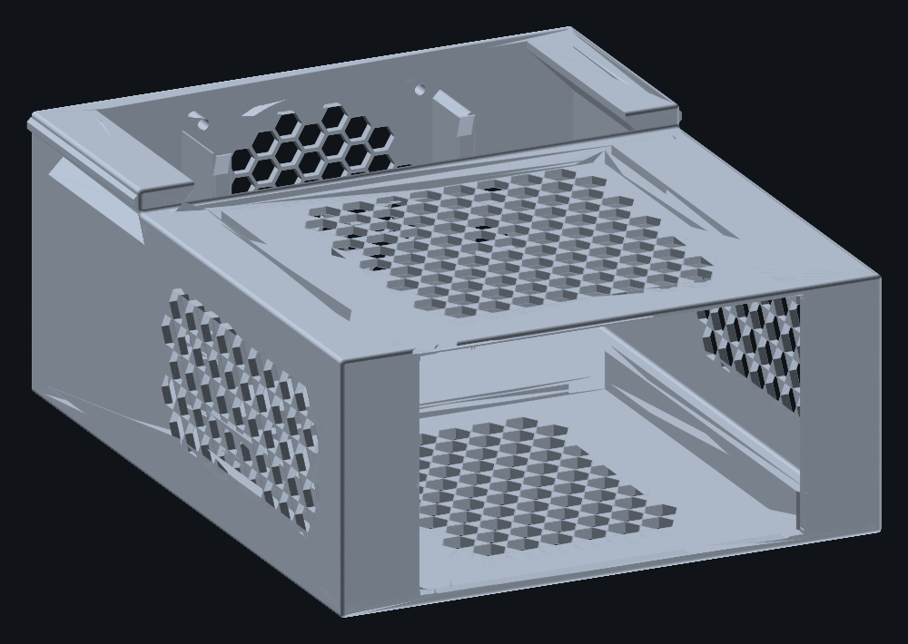
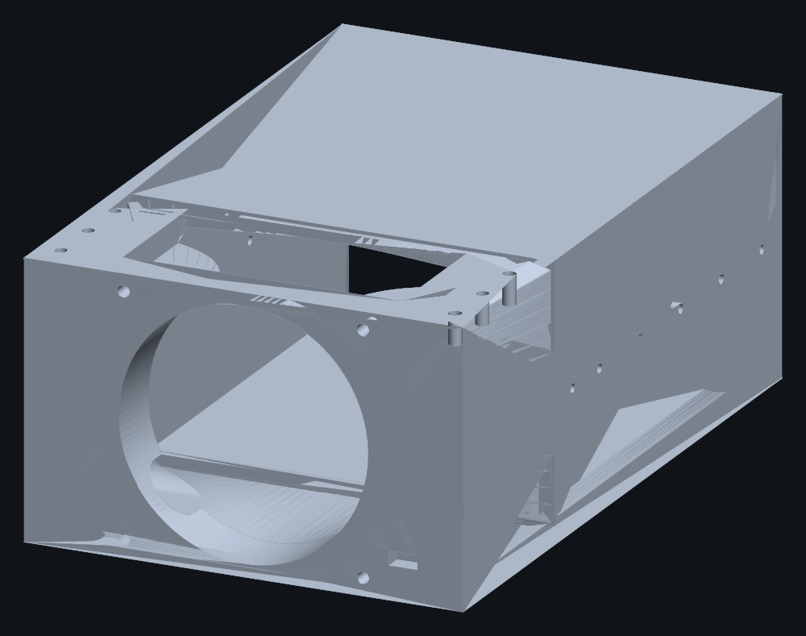
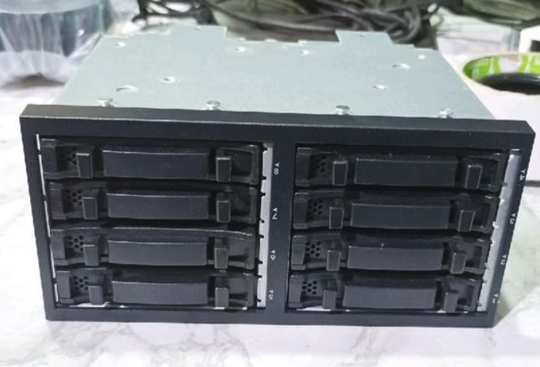
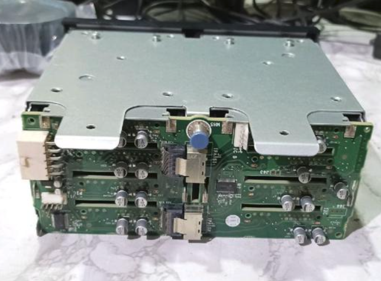

# DL380 Case — desktop enclosure for an HP ProLiant DL380 G6/G7 8-bay 2.5" SFF drive cage

Parametric [FreeCAD](https://www.freecad.org/) Python model of an external desktop
enclosure that turns a salvaged **HP ProLiant DL380 G6/G7 8-bay 2.5" SFF drive cage
with backplane** (cage assy P/N 496074-001 and relatives) into a standalone,
fan-cooled JBOD-style box.

Everything is generated from one script — change a number at the top, re-run,
get a new STEP file. The case height is *derived from the fan*, so swapping fan
size re-shapes the enclosure by itself.





---

## Status

| | |
|---|---|
| Shell | `freecadcmd dl380_cage_case.py` builds and exports clean, no errors |
| Body solid | valid ✓ closed ✓ **151.40 × 94.60 × 235.60 mm** |
| Lid solid | valid ✓ closed ✓ 151.40 × 5.00 × 70.60 mm |
| Top profile | **flat** — rear section is the same 94.6 mm as the bay |
| Body ↔ lid interference | 0.0000 mm³ |
| Build volume (Bambu Lab H2S, 340×320×340) | body fits ✓ lid fits ✓ |
| Lid insert bosses | 13.0 mm of solid material around every Ø4.2 bore ✓ |
| Cable egress | slot verified open through the wall ✓ |

Full generated report: [`out/dl380_cage_case_report.txt`](out/dl380_cage_case_report.txt)

---

## Target hardware

The cage this was designed around, photographed on the bench:

| Photo | What it shows |
|---|---|
|  | Stamped steel cage, side/top mounting holes |
|  | Black plastic front bezel, 8 × 2.5" caddy slots |
|  | Backplane PCBs and the top mounting rail |

Nominal cage envelope used for the model: **145.0 × 87.0 × 165.0 mm (W × H × D)**.

---

## Design

```
      z=0                                                          z=235.6
      |  <------------- 165.0 mm bay ------------->|<- 65 plenum ->|<- wall
      +============================================+===============+   y=94.6
      |  ^                                         |  airflow      |    FLAT
      |  |                                         |  transition   |    TOP
      |  |  HP cage sleeve, front wide open         |  rect->circle |
      |  |  145.8 x 87.8  (+0.4 mm/side)            |               |
      |  |                                         |  SFF-8087 +   |
      |  |  ### internal rear stop frame ###        |  Wago 221 bay |
      |  v                                         |               |   y=0
      +============================================+=== O86 fan ===+
                                                      (rear face)
```

### Sections

**Bay (z 0 → 165)** — a plain sleeve, internal **145.8 × 87.8 mm**. The front is
fully open so standard HP 2.5" SFF caddies and their latch/eject levers slide
straight in and out. A **3 mm deep internal stop frame** around the rear of the
bay seats the cage; the frame's inner aperture is 137.8 × 79.8 mm, so it stops the
cage without choking the airflow path through the backplane.

**Plenum (z 165 → 230)** — 65 mm of clear volume behind the backplane for the two
SFF-8087 mini-SAS cable boots and three Wago 221 lever terminal blocks. On a flat
top the plenum is simply the full-height cavity behind the cage, and the service
opening drops straight into it.

**Duct** — an internal **rect → circle transition**. A ruled loft between the
145.8 × 87.8 sleeve rectangle and an Ø86 circle centred on the fan axis, built from
two angle-matched 96-gon wires so the surface is twist-free. This is the "tapered
bevel" of the brief: it squeezes the 12 801 mm² cage aperture down to the fan's
5 809 mm² swept disc over 65 mm instead of dumping a rectangular jet at a round fan.

**Rear wall (z 230 → 235.6)** — 5.6 mm thick: Ø86 aperture centred at Y = 47.3,
four Ø4.2 holes on an 82.5 × 82.5 mm square pattern for M3 heat-set inserts (or
Ø4.5 for M4 pass-through — change `FAN_HOLE`), and a 10 × 5 mm notch at X = +55 for
the fan's own cable. Edge margin is 4.30 mm around the aperture and 3.95 mm around
the mounting holes.

**Cable egress** — a 16 × 30 mm stadium (rounded-end) slot in the left wall at the
rear of the plenum, Y 12 → 28 mm, for two external SAS cables plus one Molex DC
harness. Rounded ends act as strain relief. Set `CABLE_SLOT_MIRROR = True` to cut
the same slot in the right wall.

**Lid** — the body is a single cohesive print with a closed top over the bay; the
plenum gets a separable **service lid** so you can get at the cabling after the
cage is in. The lid is a 3 mm plate with a locating lip that drops into a 96 mm
rounded opening, held by **6 × M3** screws into heat-set inserts (3 per side, Z =
185 / 205 / 225 — all clear of the caddy path).

**Base** — four Ø12 × 2 mm recesses for rubber feet, in a 4 mm floor.

### Why 92 mm, and why that gives a flat top

The original brief specified a **120 mm fan**. The problem: a 120 mm fan needs
`105 mm` of mounting pattern plus hole radius plus edge material ≈ **123 mm** of
rear wall, but the airflow it has to clear comes out of an aperture only
**87.8 mm tall**. A 120 mm fan therefore *cannot* sit in a case the height of the
cage — it forces a raised rear tower, which is what v1 of this model had
(132 mm rear section, L-shaped side profile).

Dropping to a **92 mm fan** removes the tower entirely: `82.5 + 4.2 + 2×3.5 =
93.7 mm`, which fits inside the 94.6 mm bay height. So the case becomes a plain
prism with a **flat top**, and the fan sits on the cage centreline (Y = 47.3)
instead of 19 mm above it, which also makes the duct symmetric.

This is enforced in code, not by hand — `REAR_H` is computed as
`max(BAY_H, FAN_APERTURE + 2*FAN_EDGE, 2*(FAN_OFF + FAN_HOLE/2 + FAN_EDGE))`.
Set `FAN_APERTURE = 115.0` and `FAN_PATTERN = 105.0` and the rear section grows to
122 mm on its own; the report tells you which profile you got.

---

## BOM

| Item | Qty | Notes |
|---|---|---|
| Printed body | 1 | ≈ 650 cm³ / ≈ 826 g at 1.27 g/cm³ |
| Printed service lid | 1 | ≈ 41 cm³ / ≈ 52 g |
| 92 × 92 × 25 mm fan | 1 | rear-mounted, exhaust |
| M3 × 6 heat-set insert | 6 | into the lid bosses |
| M3 × 10–12 screw | 6 | lid |
| M3 screw + nut | 2–6 | cage anchoring (see caveats) |
| Rubber feet Ø12 × 2 mm | 4 | |
| SFF-8087 → SFF-8088 cables | 2 | exit through the side slot |
| Molex / SATA power harness | 1 | same slot |

### Print settings

PETG or ASA suggested (the plenum sees warm server air). 0.2 mm layers, 3–4 walls,
4–5 top/bottom layers. **No supports needed** — the part prints flat on its base
with the front opening up; the duct is a shallow taper, not an overhang.

---

## Rebuilding

```bash
# generate STEP + STL + report into ./out
freecadcmd dl380_cage_case.py

# optional: dependency-free preview renders (SVG -> PNG via rsvg-convert)
python3 render_stl.py out/dl380_cage_case_body.stl out/body.png
```

Tested with FreeCAD 1.1.3 (`freecadcmd`). The script also runs from the FreeCAD GUI
Python console via `exec(open("dl380_cage_case.py").read())`.

`render_stl.py` is a self-contained painter's-algorithm shaded renderer — it only
needs `rsvg-convert` (or any SVG rasteriser) and no Python packages at all. It draws
a front, rear, side, top and half-section cutaway view.

---

## Parameters

All at the top of `dl380_cage_case.py`. Nothing derived is hand-edited.

| Parameter | Default | Meaning |
|---|---|---|
| `CAGE_W` / `CAGE_H` / `CAGE_D` | 145.0 / 87.0 / 165.0 | HP cage envelope |
| `FIT_CLEAR` | 0.4 | slide-in clearance, per side |
| `WALL` / `FLOOR_T` | 2.8 / 4.0 | wall and floor thickness |
| `PLENUM_D` | 65.0 | clear depth behind the backplane |
| `FAN_SIZE` | 92.0 | nominal fan frame (documentation only) |
| `FAN_APERTURE` / `FAN_PATTERN` | 86.0 / 82.5 | opening Ø and hole pattern |
| `FAN_HOLE` | 4.2 | 4.2 for M3 inserts, 4.5 for M4 pass-through |
| `FAN_EDGE` | 3.5 | min material between a hole and the case edge |
| `CABLE_SLOT_C` / `CABLE_SLOT_SZ` | (20, 213) / (16, 30) | egress slot position and size |
| `CAGE_SCREW_Z` | 15…155 | candidate cage anchor positions |
| `LID_SCREW_X` / `LID_SCREW_Z` | 68.0 / (185, 205, 225) | lid screw positions |
| `REAR_H` | *derived* | follows the fan automatically |

---

## Caveats — read before printing

1. **Cage side-screw positions are unverified.** `CAGE_SCREW_Z` places six Ø3.4 holes
   per side wall as a *menu*, not a measurement — the real cage's own holes were not
   measured. Check which position lines up with your cage and drop the rest from the
   list before you print. The rear stop frame holds the cage regardless.
2. **Fan edge margin is 3.95 mm** around the Ø4.2 mounting holes, because a 92 mm
   fan pattern is very nearly the full 94.6 mm case height. That is fine for M3 in
   PETG, but if you want more, go down to an 80 mm fan
   (`FAN_APERTURE = 76.0`, `FAN_PATTERN = 71.5`) — nothing else needs changing.
3. **Dimensions are from the brief, not from calipers.** If your cage measures
   differently, change `CAGE_W` / `CAGE_H` / `CAGE_D` and rebuild.
4. Nothing here has been printed yet. The geometry is verified as valid, closed and
   non-interfering, but that is not the same as a successful print.

---

## Repository layout

```
dl380_cage_case.py            parametric model -> STEP/STL (the thing to edit)
render_stl.py                 standalone STL -> shaded PNG renderer
docs/reference/               photos of the target hardware
out/
  dl380_cage_case.step        body + lid, high precision  <- deliverable
  dl380_cage_case_body.step   body only
  dl380_cage_case_lid.step    lid only
  dl380_cage_case_body.stl    print mesh
  dl380_cage_case_lid.stl     print mesh
  dl380_cage_case_report.txt  derived dimensions + sanity checks
  *.png                       preview renders
```

---

## License

MIT — see [LICENSE](LICENSE).
